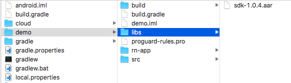

# UserIQ Android SDK Integration

This guide will provide you with step by step details on how to integrate the SDK in just a few minutes. The following steps outline the integration process in details.

## Steps to integrate the sdk to your Android project (for Android Studio)

- [Step 1 : Add the dependency for UserIQ SDK](#step-1--add-the-dependency-for-useriq-sdk)
- [Step 2 : Initialize the SDK](#step-2--initialize-the-sdk)
- [Step 3 : Set the user](#step-3--set-the-user)
- [Step 4 : Add the custom parameters (optional)](#step-4--add-the-custom-parameters-optional)
- [Step 5 : Logout](#step-5--logout)
- [Step 6 : Configure ProGuard](#step-6--configure-proguard)


### Step 1 : Add the dependency for UserIQ SDK

1. Open build.gradle from the app folder of your project and include the SDK

```groovy
android {
    ...
}
repositories {
    jcenter()
}
dependencies {
  implementation 'com.useriq:sdk:2.8.1'
  ... // your dependencies
}
```

### Step 2 : Initialize the SDK 

1. Initialize UserIQSDK by calling `init(Activity activity, String api)`

```java
import com.useriq.sdk.UserIQSDK;
...
@Override
protected void onCreate(Bundle savedInstanceState) {
    super.onCreate(savedInstanceState);
    
    UserIQSDK.init(this, "API_KEY");
    
    //your code
}
```

### Step 3 : Set the user

1. Open up the home activity (the activity, which comes immediately after the login)
2. Build the user using `UserIQSDK.UserBuilder` & set the user via `setUser(Context context, User user)` method of UserIQSDK.

```java
import com.useriq.sdk.UserIQSDK;
...
@Override
protected void onCreate(Bundle savedInstanceState) {
    UserIQSDK.User user = new UserIQSDK.UserBuilder()
            .setId("EMP124")
            .setAccountId("1")
            .setAccountName("Acme Corp")
            .setName("Alex")
            .setEmail("alex@useriq.com")
            .addParams("location", "Atlanta")
            .build();
    UserIQSDK.setUser(this, user);
          
    //your code
}
```

### Step 4 : Add the custom parameters (optional)

Add any custom attributes about the user in the `addParams(String key, String value)`

E.g.- `.addParams("location", "Atlanta")`

`.addParams("userType", "admin")`

`.addParams("profession", "Dietician")`

### Step 5 : Logout

If a user logs out, the user can be reset to anonymous user just by calling the `logout` API. Make sure this method is called when the user logs out, so that login screen tracking and other information not related to the user does not get linked to the user.

```java
UserIQSDK.logOut()
```

### Step 6 : Configure ProGuard

If you use proguard, you may need to add the following lines to your proguard rules file

```pro
# Retain UserIQ SDK service while optimizing.
-keep public class com.useriq.sdk.SDKService {
    public *;
}
```

## Alternate Installation

1. [Download](https://github.com/useriq-com/android-sdk/tree/master/SDK) the .aar file.
2. Add the .aar file to your project's libs folder. 
    
3. Initialize the SDK. [(Step 2)](#step-2--initialize-the-sdk)
4. Set the user. [(Step 3)](#step-3--set-the-user)

Note - The **_API-KEY_** can be obtained from the integration page of your app in the UserIQ dashboard.

# API & USAGE

For more details on API & usage, please refer to [wiki page](https://github.com/useriq-com/android-sdk/wiki)

